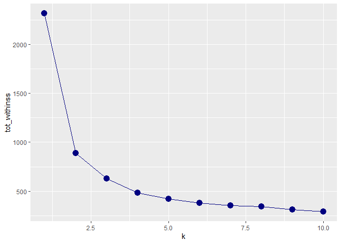
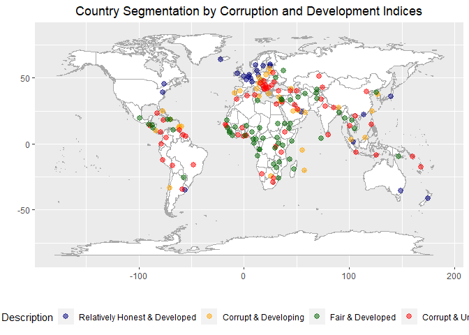
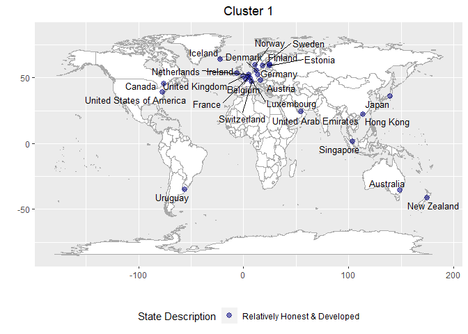
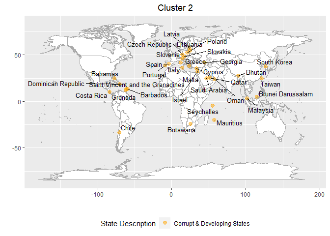
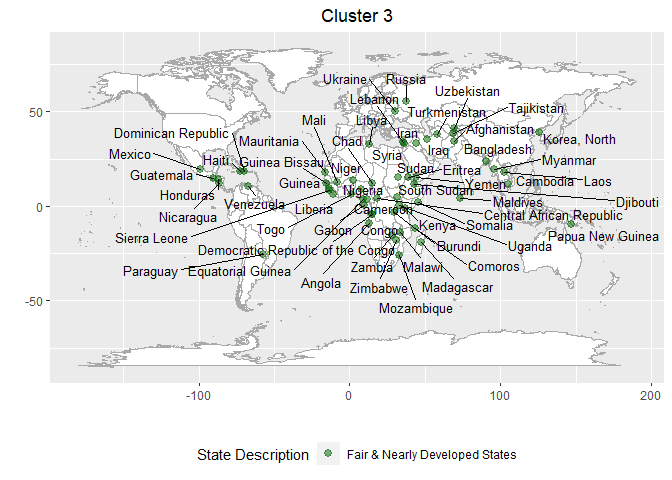
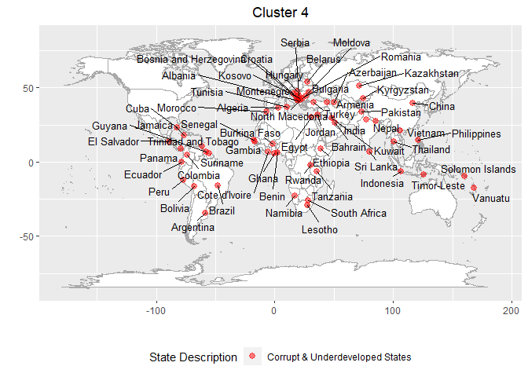

Country Segmentation by Corruption and Development Indices
================
Jansen Lopez
8/14/2020

### Summary:

#### The Global Corruption Perception Index ranks the countries from the least corrupt to the most corrupt. But I wanted a more succint categorization of a country’s perceived corruption-not just it’s rank. In addition I added features that will mix the country’s development to see whether less corruption correlates with progress. (The data were from 2018 and 2019)

### Methodology:

#### Use the k-means algorithm on different numerical features that pertains to corruption, happiness, and human development in order to derive cluster of countries with similar features. And arbitrarily describe these clusters based on their instrinsic characteristics.

``` r
library(skimr)
library(tidymodels)
```

    ## -- Attaching packages ------------------------------------------- tidymodels 0.1.1 --

    ## v broom     0.7.0      v recipes   0.1.13
    ## v dials     0.0.8      v rsample   0.0.7 
    ## v dplyr     1.0.0      v tibble    3.0.3 
    ## v ggplot2   3.3.2      v tidyr     1.1.0 
    ## v infer     0.5.3      v tune      0.1.1 
    ## v modeldata 0.0.2      v workflows 0.1.2 
    ## v parsnip   0.1.2      v yardstick 0.0.7 
    ## v purrr     0.3.4

    ## -- Conflicts ---------------------------------------------- tidymodels_conflicts() --
    ## x purrr::discard() masks scales::discard()
    ## x dplyr::filter()  masks stats::filter()
    ## x dplyr::lag()     masks stats::lag()
    ## x recipes::step()  masks stats::step()

``` r
library(tidyverse)
```

    ## -- Attaching packages -------------------------------------------- tidyverse 1.3.0 --

    ## v readr   1.3.1     v forcats 0.5.0
    ## v stringr 1.4.0

    ## -- Conflicts ----------------------------------------------- tidyverse_conflicts() --
    ## x readr::col_factor() masks scales::col_factor()
    ## x purrr::discard()    masks scales::discard()
    ## x dplyr::filter()     masks stats::filter()
    ## x stringr::fixed()    masks recipes::fixed()
    ## x dplyr::lag()        masks stats::lag()
    ## x readr::spec()       masks yardstick::spec()

``` r
library(ggmap)
```

    ## Google's Terms of Service: https://cloud.google.com/maps-platform/terms/.

    ## Please cite ggmap if you use it! See citation("ggmap") for details.

``` r
library(maptools)
```

    ## Loading required package: sp

    ## Checking rgeos availability: FALSE
    ##      Note: when rgeos is not available, polygon geometry     computations in maptools depend on gpclib,
    ##      which has a restricted licence. It is disabled by default;
    ##      to enable gpclib, type gpclibPermit()

``` r
library(maps)  
```

    ## 
    ## Attaching package: 'maps'

    ## The following object is masked from 'package:purrr':
    ## 
    ##     map

``` r
library(ggrepel)

cpi_raw <- read.csv("CPI_2019_final_dataset.csv")
View(cpi_raw)
skim(cpi_raw)
```

|                                                  |          |
| :----------------------------------------------- | :------- |
| Name                                             | cpi\_raw |
| Number of rows                                   | 180      |
| Number of columns                                | 22       |
| \_\_\_\_\_\_\_\_\_\_\_\_\_\_\_\_\_\_\_\_\_\_\_   |          |
| Column type frequency:                           |          |
| character                                        | 3        |
| numeric                                          | 19       |
| \_\_\_\_\_\_\_\_\_\_\_\_\_\_\_\_\_\_\_\_\_\_\_\_ |          |
| Group variables                                  | None     |

Data summary

**Variable type: character**

| skim\_variable | n\_missing | complete\_rate | min | max | empty | n\_unique | whitespace |
| :------------- | ---------: | -------------: | --: | --: | ----: | --------: | ---------: |
| Country        |          0 |              1 |   1 |  32 |     0 |       180 |          0 |
| ISO3           |          0 |              1 |   3 |   3 |     0 |       180 |          0 |
| Region         |          0 |              1 |   2 |   5 |     0 |         6 |          0 |

**Variable type: numeric**

| skim\_variable                                      | n\_missing | complete\_rate |  mean |    sd |    p0 |   p25 |   p50 |    p75 |   p100 | hist  |
| :-------------------------------------------------- | ---------: | -------------: | ----: | ----: | ----: | ----: | ----: | -----: | -----: | :---- |
| CPI.score.2019                                      |          0 |           1.00 | 43.17 | 18.96 |  9.00 | 29.00 | 39.50 |  56.00 |  87.00 | ▂▇▅▃▂ |
| Rank                                                |          0 |           1.00 | 88.97 | 51.66 |  1.00 | 44.00 | 88.00 | 130.00 | 180.00 | ▇▇▇▇▇ |
| standard.error                                      |          0 |           1.00 |  3.14 |  1.57 |  0.81 |  2.15 |  2.65 |   3.61 |   9.78 | ▇▆▂▁▁ |
| Number.of.sources                                   |          0 |           1.00 |  7.06 |  1.79 |  3.00 |  6.00 |  7.00 |   8.00 |  10.00 | ▂▂▇▅▅ |
| Lower.CI                                            |          0 |           1.00 | 38.02 | 18.98 |  6.15 | 24.08 | 34.13 |  50.03 |  83.25 | ▃▇▃▂▂ |
| Upper.CI                                            |          0 |           1.00 | 48.32 | 19.29 | 11.85 | 33.28 | 44.31 |  62.35 |  91.17 | ▂▇▅▃▂ |
| African.Development.Bank.CPIA                       |        143 |           0.21 | 27.06 | 12.73 |  3.53 | 16.25 | 26.51 |  36.78 |  49.49 | ▅▂▆▇▃ |
| Bertelsmann.Foundation.Sustainable.Governance.Index |        139 |           0.23 | 66.06 | 16.84 | 26.04 | 52.65 | 70.39 |  79.26 |  96.99 | ▂▅▃▇▂ |
| Bertelsmann.Foundation.Transformation.Index         |         43 |           0.76 | 36.22 | 15.55 |  8.91 | 28.86 | 32.85 |  44.81 |  76.73 | ▅▇▇▃▂ |
| Economist.Intelligence.Unit.Country.Ratings         |         49 |           0.73 | 45.53 | 21.70 | 19.79 | 37.26 | 37.26 |  54.73 |  89.67 | ▆▇▅▃▂ |
| Freedom.House.Nations.in.Transit.Ratings            |        151 |           0.16 | 44.69 | 16.75 | 20.75 | 32.62 | 47.46 |  59.32 |  77.13 | ▇▆▇▅▃ |
| Global.Insight.Country.Risk.Ratings                 |          0 |           1.00 | 43.76 | 19.11 | 10.22 | 34.50 | 40.62 |  58.97 |  83.26 | ▆▇▆▅▅ |
| IMD.World.Competitiveness.Yearbook                  |        117 |           0.35 | 58.20 | 21.97 | 23.33 | 41.01 | 53.64 |  80.77 |  93.87 | ▆▇▃▅▇ |
| PERC.Asia.Risk.Guide                                |        165 |           0.08 | 50.77 | 19.03 | 33.65 | 36.40 | 46.11 |  57.70 |  89.10 | ▇▅▁▁▃ |
| PRS.International.Country.Risk.Guide                |         40 |           0.78 | 44.74 | 20.73 |  6.29 | 32.42 | 41.13 |  58.55 |  93.38 | ▁▇▃▂▂ |
| Varieties.of.Democracy.Project                      |          6 |           0.97 | 42.33 | 21.65 |  9.44 | 23.19 | 39.10 |  63.34 |  78.17 | ▇▇▆▃▇ |
| World.Bank.CPIA                                     |        113 |           0.37 | 31.38 | 11.54 | 10.12 | 26.78 | 26.78 |  35.11 |  60.11 | ▃▇▆▂▂ |
| World.Economic.Forum.EOS                            |         46 |           0.74 | 46.98 | 20.70 |  5.40 | 30.69 | 43.19 |  58.36 |  92.73 | ▂▇▆▃▃ |
| World.Justice.Project.Rule.of.Law.Index             |         57 |           0.68 | 44.84 | 20.05 | 13.12 | 29.74 | 38.28 |  59.83 |  87.68 | ▅▇▂▃▃ |

#### Remove some corruption scores due to lack of data and some features that aren’t as important

``` r
cpi_filtered <- cpi_raw %>%
  select(-standard.error, -Number.of.sources, -Lower.CI, -Upper.CI, -African.Development.Bank.CPIA,
         -Bertelsmann.Foundation.Sustainable.Governance.Index, -PERC.Asia.Risk.Guide,
         -Freedom.House.Nations.in.Transit.Ratings)
```

#### Rename the columns

``` r
names(cpi_filtered)
```

    ##  [1] "Country"                                    
    ##  [2] "ISO3"                                       
    ##  [3] "Region"                                     
    ##  [4] "CPI.score.2019"                             
    ##  [5] "Rank"                                       
    ##  [6] "Bertelsmann.Foundation.Transformation.Index"
    ##  [7] "Economist.Intelligence.Unit.Country.Ratings"
    ##  [8] "Global.Insight.Country.Risk.Ratings"        
    ##  [9] "IMD.World.Competitiveness.Yearbook"         
    ## [10] "PRS.International.Country.Risk.Guide"       
    ## [11] "Varieties.of.Democracy.Project"             
    ## [12] "World.Bank.CPIA"                            
    ## [13] "World.Economic.Forum.EOS"                   
    ## [14] "World.Justice.Project.Rule.of.Law.Index"

``` r
names(cpi_filtered) <- c("Country",
                         "ISO3",
                         "Region",
                         "CPI_score_2019",
                         "Rank",
                         "Bertelsmann_Foundation_Transformation_Index",
                         "Economist_Intelligence_Unit_Country_Ratings",
                         "Global_Insight_Country_Risk_Ratings",
                         "IMD_World_Competitiveness_Yearbook",
                         "PRS_International_Country_Risk_Guide",
                         "Varieties_of_Democracy_Project",
                         "World_Bank_CPIA",
                         "World_Economic_Forum_EOS",
                         "World_Justice_Project_Rule_of_Law_Index")
```

#### Remove an erroneous country name “p”

``` r
dim(cpi_filtered)
```

    ## [1] 180  14

``` r
cpi_filtered <- cpi_filtered %>%
  filter(Country != "p")

dim(cpi_filtered)
```

    ## [1] 179  14

#### Add the 2019 happiness scores of countries to add features that will work alongside / against corruption

``` r
happy_2019 <- read.csv("happiness_2019.csv")

happy_2019_filtered <- happy_2019 %>%
  select(Country.or.region, Score)

names(happy_2019_filtered) <- c("Country", "Happiness_Score")

happy_2019_filtered %>% arrange(Country) %>% .$Country
```

    ##   [1] "Afghanistan"              "Albania"                 
    ##   [3] "Algeria"                  "Argentina"               
    ##   [5] "Armenia"                  "Australia"               
    ##   [7] "Austria"                  "Azerbaijan"              
    ##   [9] "Bahrain"                  "Bangladesh"              
    ##  [11] "Belarus"                  "Belgium"                 
    ##  [13] "Benin"                    "Bhutan"                  
    ##  [15] "Bolivia"                  "Bosnia and Herzegovina"  
    ##  [17] "Botswana"                 "Brazil"                  
    ##  [19] "Bulgaria"                 "Burkina Faso"            
    ##  [21] "Burundi"                  "Cambodia"                
    ##  [23] "Cameroon"                 "Canada"                  
    ##  [25] "Central African Republic" "Chad"                    
    ##  [27] "Chile"                    "China"                   
    ##  [29] "Colombia"                 "Comoros"                 
    ##  [31] "Congo (Brazzaville)"      "Congo (Kinshasa)"        
    ##  [33] "Costa Rica"               "Croatia"                 
    ##  [35] "Cyprus"                   "Czech Republic"          
    ##  [37] "Denmark"                  "Dominican Republic"      
    ##  [39] "Ecuador"                  "Egypt"                   
    ##  [41] "El Salvador"              "Estonia"                 
    ##  [43] "Ethiopia"                 "Finland"                 
    ##  [45] "France"                   "Gabon"                   
    ##  [47] "Gambia"                   "Georgia"                 
    ##  [49] "Germany"                  "Ghana"                   
    ##  [51] "Greece"                   "Guatemala"               
    ##  [53] "Guinea"                   "Haiti"                   
    ##  [55] "Honduras"                 "Hong Kong"               
    ##  [57] "Hungary"                  "Iceland"                 
    ##  [59] "India"                    "Indonesia"               
    ##  [61] "Iran"                     "Iraq"                    
    ##  [63] "Ireland"                  "Israel"                  
    ##  [65] "Italy"                    "Ivory Coast"             
    ##  [67] "Jamaica"                  "Japan"                   
    ##  [69] "Jordan"                   "Kazakhstan"              
    ##  [71] "Kenya"                    "Kosovo"                  
    ##  [73] "Kuwait"                   "Kyrgyzstan"              
    ##  [75] "Laos"                     "Latvia"                  
    ##  [77] "Lebanon"                  "Lesotho"                 
    ##  [79] "Liberia"                  "Libya"                   
    ##  [81] "Lithuania"                "Luxembourg"              
    ##  [83] "Madagascar"               "Malawi"                  
    ##  [85] "Malaysia"                 "Mali"                    
    ##  [87] "Malta"                    "Mauritania"              
    ##  [89] "Mauritius"                "Mexico"                  
    ##  [91] "Moldova"                  "Mongolia"                
    ##  [93] "Montenegro"               "Morocco"                 
    ##  [95] "Mozambique"               "Myanmar"                 
    ##  [97] "Namibia"                  "Nepal"                   
    ##  [99] "Netherlands"              "New Zealand"             
    ## [101] "Nicaragua"                "Niger"                   
    ## [103] "Nigeria"                  "North Macedonia"         
    ## [105] "Northern Cyprus"          "Norway"                  
    ## [107] "Pakistan"                 "Palestinian Territories" 
    ## [109] "Panama"                   "Paraguay"                
    ## [111] "Peru"                     "Philippines"             
    ## [113] "Poland"                   "Portugal"                
    ## [115] "Qatar"                    "Romania"                 
    ## [117] "Russia"                   "Rwanda"                  
    ## [119] "Saudi Arabia"             "Senegal"                 
    ## [121] "Serbia"                   "Sierra Leone"            
    ## [123] "Singapore"                "Slovakia"                
    ## [125] "Slovenia"                 "Somalia"                 
    ## [127] "South Africa"             "South Korea"             
    ## [129] "South Sudan"              "Spain"                   
    ## [131] "Sri Lanka"                "Swaziland"               
    ## [133] "Sweden"                   "Switzerland"             
    ## [135] "Syria"                    "Taiwan"                  
    ## [137] "Tajikistan"               "Tanzania"                
    ## [139] "Thailand"                 "Togo"                    
    ## [141] "Trinidad & Tobago"        "Tunisia"                 
    ## [143] "Turkey"                   "Turkmenistan"            
    ## [145] "Uganda"                   "Ukraine"                 
    ## [147] "United Arab Emirates"     "United Kingdom"          
    ## [149] "United States"            "Uruguay"                 
    ## [151] "Uzbekistan"               "Venezuela"               
    ## [153] "Vietnam"                  "Yemen"                   
    ## [155] "Zambia"                   "Zimbabwe"

#### Rename some countries so that they could work as matching keys

``` r
happy_2019_filtered[happy_2019_filtered$Country == "Congo (Brazzaville)", "Country"] <- "Congo"
happy_2019_filtered[happy_2019_filtered$Country == "Congo (Kinshasa)", "Country"] <- "Democratic Republic of the Congo"
happy_2019_filtered[happy_2019_filtered$Country == "Ivory Coast", "Country"] <- "Cote d'Ivoire"
happy_2019_filtered[happy_2019_filtered$Country == "United States", "Country"] <- "United States of America"

cpi_filtered[cpi_filtered$Country == "Dominica", "Country"] <- "Dominican Republic"
cpi_filtered[cpi_filtered$Country == "Korea, South", "Country"] <- "South Korea"
```

#### Join the Happiness dataframe into the CPI dataframe

``` r
left_join(cpi_filtered, happy_2019_filtered) %>% filter(is.na(Happiness_Score)) %>%
  arrange(Country) %>% .$Country
```

    ## Joining, by = "Country"

    ##  [1] "Angola"                           "Bahamas"                         
    ##  [3] "Barbados"                         "Brunei Darussalam"               
    ##  [5] "Cabo Verde"                       "Cuba"                            
    ##  [7] "Djibouti"                         "Equatorial Guinea"               
    ##  [9] "Eritrea"                          "Eswatini"                        
    ## [11] "Grenada"                          "Guinea Bissau"                   
    ## [13] "Guyana"                           "Korea, North"                    
    ## [15] "Maldives"                         "Oman"                            
    ## [17] "Papua New Guinea"                 "Saint Lucia"                     
    ## [19] "Saint Vincent and the Grenadines" "Sao Tome and Principe"           
    ## [21] "Seychelles"                       "Solomon Islands"                 
    ## [23] "Sudan"                            "Suriname"                        
    ## [25] "Timor-Leste"                      "Trinidad and Tobago"             
    ## [27] "Vanuatu"

``` r
cpi_happy_filtered <- left_join(cpi_filtered, happy_2019_filtered)
```

    ## Joining, by = "Country"

``` r
View(cpi_happy_filtered)
```

#### Load and clean the IHDI dataset (Inequality Adjusted Human Development Index)

``` r
ihdi_2018_raw <- read.csv("IHDI_2018.csv")
View(ihdi_2018_raw)

names(ihdi_2018_raw) <- c("Rank", "Country", "IHDI")
ihdi_2018_filtered <- ihdi_2018_raw %>%
  mutate(Country = str_remove_all(Country, "Â"),
         Country = str_extract(Country, "\\w{1}.*$")) %>%
  select("Country", "IHDI")
         
ihdi_2018_filtered$Country[1]
```

    ## [1] "Norway"

``` r
ihdi_2018_filtered$Country
```

    ##   [1] "Norway"                           "Iceland"                         
    ##   [3] "Japan"                            "Switzerland"                     
    ##   [5] "Finland"                          "Sweden"                          
    ##   [7] "Denmark"                          "Ireland"                         
    ##   [9] "Netherlands"                      "Australia"                       
    ##  [11] "Germany"                          "Slovenia"                        
    ##  [13] "Czech Republic"                   "Belgium"                         
    ##  [15] "United Kingdom"                   "Austria"                         
    ##  [17] "Canada"                           "New Zealand"                     
    ##  [19] "Luxembourg"                       "Estonia"                         
    ##  [21] "Hong Kong"                        "Malta"                           
    ##  [23] "Singapore"                        "France"                          
    ##  [25] "Israel"                           "Slovakia"                        
    ##  [27] "Poland"                           "United States"                   
    ##  [29] "Cyprus"                           "Hungary"                         
    ##  [31] "South Korea"                      "Italy"                           
    ##  [33] "Latvia"                           "Lithuania"                       
    ##  [35] "Croatia"                          "Greece"                          
    ##  [37] "Belarus"                          "Spain"                           
    ##  [39] "Kazakhstan"                       "Montenegro"                      
    ##  [41] "Russia"                           "Portugal"                        
    ##  [43] "Oman"                             "Romania"                         
    ##  [45] "Argentina"                        "Bulgaria"                        
    ##  [47] "Serbia"                           "Iran"                            
    ##  [49] "Albania"                          "Uruguay"                         
    ##  [51] "Ukraine"                          "Georgia"                         
    ##  [53] "Mauritius"                        "Sri Lanka"                       
    ##  [55] "Armenia"                          "Azerbaijan"                      
    ##  [57] "Turkey"                           "Barbados"                        
    ##  [59] "Chile"                            "North Macedonia"                 
    ##  [61] "Bosnia and Herzegovina"           "Costa Rica"                      
    ##  [63] "Moldova"                          "China"                           
    ##  [65] "Mongolia"                         "Thailand"                        
    ##  [67] "Panama"                           "Jordan"                          
    ##  [69] "Saint Lucia"                      "Peru"                            
    ##  [71] "Kyrgyzstan"                       "Ecuador"                         
    ##  [73] "Algeria"                          "Jamaica"                         
    ##  [75] "Venezuela"                        "Palestine"                       
    ##  [77] "Mexico"                           "Colombia"                        
    ##  [79] "Tunisia"                          "Dominican Republic"              
    ##  [81] "Indonesia"                        "Philippines"                     
    ##  [83] "Vietnam"                          "Turkmenistan"                    
    ##  [85] "Brazil"                           "Tajikistan"                      
    ##  [87] "Maldives"                         "Paraguay"                        
    ##  [89] "Suriname"                         "Belize"                          
    ##  [91] "Iraq"                             "Guyana"                          
    ##  [93] "Gabon"                            "India"                           
    ##  [95] "Bolivia"                          "El Salvador"                     
    ##  [97] "Sao Tome and Principe"            "Nicaragua"                       
    ##  [99] "Egypt"                            "Guatemala"                       
    ## [101] "Bangladesh"                       "Cambodia"                        
    ## [103] "Honduras"                         "South Africa"                    
    ## [105] "Congo"                            "Laos"                            
    ## [107] "Bhutan"                           "Timor-Leste"                     
    ## [109] "Myanmar"                          "Zimbabwe"                        
    ## [111] "Eswatini"                         "Nepal"                           
    ## [113] "Ghana"                            "Kenya"                           
    ## [115] "Namibia"                          "Tanzania"                        
    ## [117] "Zambia"                           "Angola"                          
    ## [119] "Uganda"                           "Madagascar"                      
    ## [121] "Pakistan"                         "Rwanda"                          
    ## [123] "Cameroon"                         "Mauritania"                      
    ## [125] "Lesotho"                          "Togo"                            
    ## [127] "Nigeria"                          "Senegal"                         
    ## [129] "Malawi"                           "Ethiopia"                        
    ## [131] "Sudan"                            "Cote d'Ivoire"                   
    ## [133] "Benin"                            "Democratic Republic of the Congo"
    ## [135] "Yemen"                            "Liberia"                         
    ## [137] "Guinea"                           "Mozambique"                      
    ## [139] "Burkina Faso"                     "Haiti"                           
    ## [141] "Burundi"                          "Comoros"                         
    ## [143] "Mali"                             "Gambia"                          
    ## [145] "Guinea-Bissau"                    "Sierra Leone"                    
    ## [147] "Niger"                            "South Sudan"                     
    ## [149] "Chad"                             "Central African Republic"

\#\#\#\#Again rename some countries so that they could work as matching
keys

``` r
ihdi_2018_filtered[ihdi_2018_filtered$Country == "Guinea-Bissau", "Country"] <- "Guinea Bissau"
ihdi_2018_filtered[ihdi_2018_filtered$Country == "United States", "Country"] <- "United States of America"

cpi_happy_ihdi_filtered <- left_join(cpi_happy_filtered, ihdi_2018_filtered, by = "Country")

View(cpi_happy_ihdi_filtered)
```

### Create reversed rankings since high scores from independent organizations means lower(ordinal) corruption ranking so we reverse the rankings so that the magnitudes of corruption scores and ranking won’t be far from each other

``` r
cpi_happy_ihdi_filtered <- cpi_happy_ihdi_filtered %>%
  mutate(Reversed_Rank = (180 - Rank) + 1)

View(cpi_happy_ihdi_filtered)
skim(cpi_happy_ihdi_filtered)
```

|                                                  |                            |
| :----------------------------------------------- | :------------------------- |
| Name                                             | cpi\_happy\_ihdi\_filtered |
| Number of rows                                   | 179                        |
| Number of columns                                | 17                         |
| \_\_\_\_\_\_\_\_\_\_\_\_\_\_\_\_\_\_\_\_\_\_\_   |                            |
| Column type frequency:                           |                            |
| character                                        | 3                          |
| numeric                                          | 14                         |
| \_\_\_\_\_\_\_\_\_\_\_\_\_\_\_\_\_\_\_\_\_\_\_\_ |                            |
| Group variables                                  | None                       |

Data summary

**Variable type: character**

| skim\_variable | n\_missing | complete\_rate | min | max | empty | n\_unique | whitespace |
| :------------- | ---------: | -------------: | --: | --: | ----: | --------: | ---------: |
| Country        |          0 |              1 |   4 |  32 |     0 |       178 |          0 |
| ISO3           |          0 |              1 |   3 |   3 |     0 |       179 |          0 |
| Region         |          0 |              1 |   2 |   5 |     0 |         6 |          0 |

**Variable type: numeric**

| skim\_variable                                  | n\_missing | complete\_rate |  mean |    sd |    p0 |   p25 |   p50 |    p75 |   p100 | hist  |
| :---------------------------------------------- | ---------: | -------------: | ----: | ----: | ----: | ----: | ----: | -----: | -----: | :---- |
| CPI\_score\_2019                                |          0 |           1.00 | 43.21 | 19.00 |  9.00 | 29.00 | 40.00 |  56.00 |  87.00 | ▂▇▅▃▂ |
| Rank                                            |          0 |           1.00 | 88.87 | 51.79 |  1.00 | 44.00 | 85.00 | 130.00 | 180.00 | ▇▇▇▇▇ |
| Bertelsmann\_Foundation\_Transformation\_Index  |         43 |           0.76 | 36.22 | 15.61 |  8.91 | 27.86 | 32.85 |  44.81 |  76.73 | ▅▇▇▃▂ |
| Economist\_Intelligence\_Unit\_Country\_Ratings |         49 |           0.73 | 45.60 | 21.78 | 19.79 | 37.26 | 37.26 |  54.73 |  89.67 | ▆▇▅▃▂ |
| Global\_Insight\_Country\_Risk\_Ratings         |          0 |           1.00 | 43.74 | 19.16 | 10.22 | 34.50 | 34.50 |  58.97 |  83.26 | ▆▇▆▅▅ |
| IMD\_World\_Competitiveness\_Yearbook           |        117 |           0.35 | 58.68 | 21.81 | 23.33 | 43.53 | 53.68 |  80.90 |  93.87 | ▆▇▃▅▇ |
| PRS\_International\_Country\_Risk\_Guide        |         40 |           0.78 | 44.81 | 20.79 |  6.29 | 32.42 | 41.13 |  58.55 |  93.38 | ▂▇▃▂▂ |
| Varieties\_of\_Democracy\_Project               |          6 |           0.97 | 42.40 | 21.70 |  9.44 | 23.19 | 39.10 |  63.70 |  78.17 | ▇▇▆▃▇ |
| World\_Bank\_CPIA                               |        113 |           0.37 | 31.32 | 11.62 | 10.12 | 26.78 | 26.78 |  35.11 |  60.11 | ▃▇▆▂▂ |
| World\_Economic\_Forum\_EOS                     |         46 |           0.74 | 47.12 | 20.71 |  5.40 | 30.83 | 43.28 |  58.36 |  92.73 | ▂▇▆▃▃ |
| World\_Justice\_Project\_Rule\_of\_Law\_Index   |         57 |           0.68 | 44.92 | 20.12 | 13.12 | 29.52 | 38.28 |  60.28 |  87.68 | ▅▇▂▃▃ |
| Happiness\_Score                                |         27 |           0.85 |  5.41 |  1.12 |  2.85 |  4.54 |  5.41 |   6.19 |   7.77 | ▂▇▇▇▅ |
| IHDI                                            |         31 |           0.83 |  0.59 |  0.19 |  0.22 |  0.43 |  0.60 |   0.76 |   0.89 | ▅▅▆▆▇ |
| Reversed\_Rank                                  |          0 |           1.00 | 92.13 | 51.79 |  1.00 | 51.00 | 96.00 | 137.00 | 180.00 | ▇▇▇▇▇ |

#### Do some pre training preparation. Impute missing values using knn, remove features with no variance, lastly normalize all predictors.

``` r
cpi_recipe <- recipe(Rank ~ .,
                  data = cpi_happy_ihdi_filtered) %>%
  update_role(Country, new_role = "Country") %>%
  update_role(ISO3, new_role = "Country_Code") %>%
  update_role(Region, new_role = "Region") %>%
  step_knnimpute(all_predictors(),
    columns = c("Bertelsmann_Foundation_Transformation_Index",
                 "Economist_Intelligence_Unit_Country_Ratings",
                 "IMD_World_Competitiveness_Yearbook",
                 "PRS_International_Country_Risk_Guide",
                 "Varieties_of_Democracy_Project",
                 "World_Bank_CPIA",
                 "World_Economic_Forum_EOS",
                 "World_Justice_Project_Rule_of_Law_Index",
                 "Happiness_Score",
                 "IHDI"),
                 neighbors = 5) %>%
  step_zv(all_numeric()) %>%
  step_normalize(all_numeric()) %>%
  prep()
```

#### Check the pre-training recipe and create the input matrix

``` r
cpi_recipe
```

    ## Data Recipe
    ## 
    ## Inputs:
    ## 
    ##          role #variables
    ##       Country          1
    ##  Country_Code          1
    ##       outcome          1
    ##     predictor         13
    ##        Region          1
    ## 
    ## Training data contained 179 data points and 179 incomplete rows. 
    ## 
    ## Operations:
    ## 
    ## K-nearest neighbor imputation for 13 items [trained]
    ## Zero variance filter removed no terms [trained]
    ## Centering and scaling for 14 items [trained]

``` r
juice(cpi_recipe) %>% View
skim(juice(cpi_recipe))
```

|                                                  |                    |
| :----------------------------------------------- | :----------------- |
| Name                                             | juice(cpi\_recipe) |
| Number of rows                                   | 179                |
| Number of columns                                | 17                 |
| \_\_\_\_\_\_\_\_\_\_\_\_\_\_\_\_\_\_\_\_\_\_\_   |                    |
| Column type frequency:                           |                    |
| factor                                           | 3                  |
| numeric                                          | 14                 |
| \_\_\_\_\_\_\_\_\_\_\_\_\_\_\_\_\_\_\_\_\_\_\_\_ |                    |
| Group variables                                  | None               |

Data summary

**Variable type: factor**

| skim\_variable | n\_missing | complete\_rate | ordered | n\_unique | top\_counts                       |
| :------------- | ---------: | -------------: | :------ | --------: | :-------------------------------- |
| Country        |          0 |              1 | FALSE   |       178 | Dom: 2, Afg: 1, Alb: 1, Alg: 1    |
| ISO3           |          0 |              1 | FALSE   |       179 | AFG: 1, AGO: 1, ALB: 1, ARE: 1    |
| Region         |          0 |              1 | FALSE   |         6 | SSA: 49, AME: 32, WE/: 31, AP: 30 |

**Variable type: numeric**

| skim\_variable                                  | n\_missing | complete\_rate | mean | sd |     p0 |    p25 |    p50 |  p75 | p100 | hist  |
| :---------------------------------------------- | ---------: | -------------: | ---: | -: | -----: | -----: | -----: | ---: | ---: | :---- |
| CPI\_score\_2019                                |          0 |              1 |    0 |  1 | \-1.80 | \-0.75 | \-0.17 | 0.67 | 2.30 | ▂▇▅▃▂ |
| Bertelsmann\_Foundation\_Transformation\_Index  |          0 |              1 |    0 |  1 | \-1.81 | \-0.73 | \-0.30 | 0.84 | 1.85 | ▅▇▇▃▅ |
| Economist\_Intelligence\_Unit\_Country\_Ratings |          0 |              1 |    0 |  1 | \-1.15 | \-0.89 | \-0.30 | 0.56 | 2.27 | ▇▇▅▂▂ |
| Global\_Insight\_Country\_Risk\_Ratings         |          0 |              1 |    0 |  1 | \-1.75 | \-0.48 | \-0.48 | 0.79 | 2.06 | ▆▇▆▅▅ |
| IMD\_World\_Competitiveness\_Yearbook           |          0 |              1 |    0 |  1 | \-1.29 | \-0.66 | \-0.37 | 0.37 | 2.79 | ▇▆▂▁▂ |
| PRS\_International\_Country\_Risk\_Guide        |          0 |              1 |    0 |  1 | \-1.87 | \-0.54 | \-0.10 | 0.37 | 2.56 | ▂▇▃▂▁ |
| Varieties\_of\_Democracy\_Project               |          0 |              1 |    0 |  1 | \-1.55 | \-0.92 | \-0.08 | 0.97 | 1.62 | ▇▇▅▅▇ |
| World\_Bank\_CPIA                               |          0 |              1 |    0 |  1 | \-2.11 | \-0.68 | \-0.25 | 0.99 | 1.62 | ▂▅▇▃▇ |
| World\_Economic\_Forum\_EOS                     |          0 |              1 |    0 |  1 | \-1.96 | \-0.77 | \-0.16 | 0.62 | 2.42 | ▂▇▆▂▂ |
| World\_Justice\_Project\_Rule\_of\_Law\_Index   |          0 |              1 |    0 |  1 | \-1.49 | \-0.78 | \-0.29 | 0.86 | 2.18 | ▆▇▂▃▃ |
| Happiness\_Score                                |          0 |              1 |    0 |  1 | \-2.37 | \-0.77 | \-0.03 | 0.70 | 2.25 | ▂▇▇▆▃ |
| IHDI                                            |          0 |              1 |    0 |  1 | \-2.00 | \-0.85 |   0.06 | 0.84 | 1.64 | ▅▆▇▇▇ |
| Reversed\_Rank                                  |          0 |              1 |    0 |  1 | \-1.76 | \-0.79 |   0.07 | 0.87 | 1.70 | ▇▇▇▇▇ |
| Rank                                            |          0 |              1 |    0 |  1 | \-1.70 | \-0.87 | \-0.07 | 0.79 | 1.76 | ▇▇▇▇▇ |

``` r
cpi_matrix <- juice(cpi_recipe) %>%
  select(-Rank, -Country, -ISO3, -Region)
```

#### Clustering and check which value of k gives us…

``` r
set.seed(1992)
kmeans_results <- sapply(1:10, function(x){
  kmeans_result <- kmeans(cpi_matrix, centers = x)
}) 

group_tot_withinss <- sapply(kmeans_results[5, ], function(x){
  x[1]
})

data.frame(k = 1:10, tot_withinss = group_tot_withinss) %>%
  ggplot(aes(k, tot_withinss)) +
  geom_point(size = 4, color = "navyblue") +
  geom_line(color = "navyblue")
```

<!-- -->

#### Choose k = 4 and see the breakdown of the categories seems like cluster 1 is a niche group of countries

``` r
kmeans_chosen <- kmeans_results[, 4]
kmeans_chosen$cluster %>%
  table %>%
  prop.table * 100.0 
```

    ## .
    ##        1        2        3        4 
    ## 13.40782 18.99441 32.40223 35.19553

#### Mapping the clusters in the world map

``` r
map_location <- read.csv("countries_capitals_long_lat.csv")
map_location
```

    ##                                          Country                     Capital
    ## 1                                       Abkhazia                     Sukhumi
    ## 2                                    Afghanistan                       Kabul
    ## 3                                  Aland Islands                   Mariehamn
    ## 4                                        Albania                      Tirana
    ## 5                                        Algeria                     Algiers
    ## 6                                 American Samoa                   Pago Pago
    ## 7                                        Andorra            Andorra la Vella
    ## 8                                         Angola                      Luanda
    ## 9                                       Anguilla                  The Valley
    ## 10                                    Antarctica                  South Pole
    ## 11                           Antigua and Barbuda                  St. John's
    ## 12                                     Argentina                Buenos Aires
    ## 13                                       Armenia                     Yerevan
    ## 14                                         Aruba                  Oranjestad
    ## 15                                     Australia                    Canberra
    ## 16                                       Austria                      Vienna
    ## 17                                    Azerbaijan                        Baku
    ## 18                                       Bahamas                      Nassau
    ## 19                                       Bahrain                      Manama
    ## 20                                    Bangladesh                       Dhaka
    ## 21                                      Barbados                  Bridgetown
    ## 22                                       Belarus                       Minsk
    ## 23                                       Belgium                    Brussels
    ## 24                                        Belize                    Belmopan
    ## 25                                         Benin                  Porto-Novo
    ## 26                                       Bermuda                    Hamilton
    ## 27                                        Bhutan                     Thimphu
    ## 28                                       Bolivia                      La Paz
    ## 29                        Bosnia and Herzegovina                    Sarajevo
    ## 30                                      Botswana                    Gaborone
    ## 31                                 Bouvet Island               Bouvet Island
    ## 32                                        Brazil                   Brasília
    ## 33                British Indian Ocean Territory                Camp Justice
    ## 34                        British Virgin Islands                   Road Town
    ## 35                                        Brunei         Bandar Seri Begawan
    ## 36                                      Bulgaria                       Sofia
    ## 37                                  Burkina Faso                 Ouagadougou
    ## 38                                       Burundi                   Bujumbura
    ## 39                                      Cambodia                  Phnom Penh
    ## 40                                      Cameroon                    Yaoundé
    ## 41                                        Canada                      Ottawa
    ## 42                                    Cape Verde                       Praia
    ## 43                                Cayman Islands                 George Town
    ## 44                      Central African Republic                      Bangui
    ## 45                                          Chad                   N'Djamena
    ## 46                                         Chile                    Santiago
    ## 47                                         China                     Beijing
    ## 48                              Christmas Island            Flying Fish Cove
    ## 49                       Cocos (Keeling) Islands                 West Island
    ## 50                                      Colombia                     Bogotá
    ## 51                                       Comoros                      Moroni
    ## 52                                   Congo (DRC)                    Kinshasa
    ## 53                              Congo (Republic)                 Brazzaville
    ## 54                                  Cook Islands                      Avarua
    ## 55                                    Costa Rica                   San José
    ## 56                                 Cote d'Ivoire                Yamoussoukro
    ## 57                                       Croatia                     Zagreb 
    ## 58                                          Cuba                      Havana
    ## 59                                       Curacao                  Willemstad
    ## 60                                        Cyprus                     Nicosia
    ## 61                                Czech Republic                      Prague
    ## 62                                       Denmark                  Copenhagen
    ## 63                                      Djibouti                    Djibouti
    ## 64                                      Dominica                      Roseau
    ## 65                            Dominican Republic               Santo Domingo
    ## 66                                       Ecuador                       Quito
    ## 67                                         Egypt                       Cairo
    ## 68                                   El Salvador                San Salvador
    ## 69                             Equatorial Guinea                      Malabo
    ## 70                                       Eritrea                      Asmara
    ## 71                                       Estonia                     Tallinn
    ## 72                                      Ethiopia                 Addis Ababa
    ## 73             Falkland Islands (Islas Malvinas)                     Stanley
    ## 74                                 Faroe Islands                   Tórshavn
    ## 75                                          Fiji                        Suva
    ## 76                                       Finland                    Helsinki
    ## 77                                        France                       Paris
    ## 78                                 French Guiana                     Cayenne
    ## 79                              French Polynesia                     Papeete
    ## 80                   French Southern Territories               Saint-Pierre 
    ## 81                                         Gabon                  Libreville
    ## 82                                        Gambia                      Banjul
    ## 83                                       Georgia                     Tbilisi
    ## 84                                       Germany                      Berlin
    ## 85                                         Ghana                       Accra
    ## 86                                     Gibraltar                   Gibraltar
    ## 87                                        Greece                      Athens
    ## 88                                     Greenland                        Nuuk
    ## 89                                       Grenada                St. George's
    ## 90                                    Guadeloupe                 Basse-Terre
    ## 91                                          Guam                   Hagåtña
    ## 92                                     Guatemala              Guatemala City
    ## 93                                      Guernsey              St. Peter Port
    ## 94                                        Guinea                     Conakry
    ## 95                                 Guinea-Bissau                      Bissau
    ## 96                                        Guyana                  Georgetown
    ## 97                                         Haiti              Port-au-Prince
    ## 98                                      Honduras                 Tegucigalpa
    ## 99                                     Hong Kong                   Hong Kong
    ## 100                                      Hungary                    Budapest
    ## 101                                      Iceland                  Reykjavík
    ## 102                                        India                   New Delhi
    ## 103                                    Indonesia                     Jakarta
    ## 104                                         Iran                      Tehran
    ## 105                                         Iraq                     Baghdad
    ## 106                                      Ireland                      Dublin
    ## 107                                  Isle of Man                     Douglas
    ## 108                                       Israel                    Tel Aviv
    ## 109                                        Italy                        Rome
    ## 110                                      Jamaica                    Kingston
    ## 111                                        Japan                       Tokyo
    ## 112                                       Jersey                  St. Helier
    ## 113                                       Jordan                       Amman
    ## 114                                   Kazakhstan                      Astana
    ## 115                                        Kenya                     Nairobi
    ## 116                                     Kiribati                Tarawa Atoll
    ## 117                                       Kosovo                    Pristina
    ## 118                                       Kuwait                 Kuwait City
    ## 119                                   Kyrgyzstan                     Bishkek
    ## 120                                         Laos                   Vientiane
    ## 121                                       Latvia                        Riga
    ## 122                                      Lebanon                      Beirut
    ## 123                                      Lesotho                      Maseru
    ## 124                                      Liberia                    Monrovia
    ## 125                                        Libya                     Tripoli
    ## 126                                Liechtenstein                       Vaduz
    ## 127                                    Lithuania                     Vilnius
    ## 128                                   Luxembourg                  Luxembourg
    ## 129                                        Macau                       Macau
    ## 130                            Macedonia (FYROM)                      Skopje
    ## 131                                   Madagascar                Antananarivo
    ## 132                                       Malawi                    Lilongwe
    ## 133                                     Malaysia                Kuala Lumpur
    ## 134                                     Maldives                       Malé
    ## 135                                         Mali                      Bamako
    ## 136                                        Malta                    Valletta
    ## 137                             Marshall Islands                      Majuro
    ## 138                                   Martinique              Fort-de-France
    ## 139                                   Mauritania                  Nouakchott
    ## 140                                    Mauritius                  Port Louis
    ## 141                                      Mayotte                   Mamoudzou
    ## 142                                       Mexico                 Mexico City
    ## 143                                   Micronesia                     Palikir
    ## 144                                      Moldova                    Chisinau
    ## 145                                       Monaco                      Monaco
    ## 146                                     Mongolia                 Ulaanbaatar
    ## 147                                   Montenegro                   Podgorica
    ## 148                                   Montserrat                    Plymouth
    ## 149                                      Morocco                       Rabat
    ## 150                                   Mozambique                      Maputo
    ## 151                              Myanmar (Burma)                   Naypyidaw
    ## 152                    Nagorno-Karabakh Republic                 Stepanakert
    ## 153                                      Namibia                    Windhoek
    ## 154                                        Nauru                       Yaren
    ## 155                                        Nepal                   Kathmandu
    ## 156                                  Netherlands                   Amsterdam
    ## 157                         Netherlands Antilles                 Willemstad 
    ## 158                                New Caledonia                     Nouméa
    ## 159                                  New Zealand                  Wellington
    ## 160                                    Nicaragua                     Managua
    ## 161                                        Niger                      Niamey
    ## 162                                      Nigeria                       Abuja
    ## 163                                         Niue                       Alofi
    ## 164                               Norfolk Island                    Kingston
    ## 165                                  North Korea                   Pyongyang
    ## 166                              Northern Cyprus                     Nicosia
    ## 167                     Northern Mariana Islands                      Saipan
    ## 168                                       Norway                        Oslo
    ## 169                                         Oman                      Muscat
    ## 170                                     Pakistan                   Islamabad
    ## 171                                        Palau                   Ngerulmud
    ## 172                                    Palestine                    Ramallah
    ## 173                                       Panama                 Panama City
    ## 174                             Papua New Guinea                Port Moresby
    ## 175                                     Paraguay                    Asuncion
    ## 176                                         Peru                        Lima
    ## 177                                  Philippines                      Manila
    ## 178                             Pitcairn Islands                   Adamstown
    ## 179                                       Poland                      Warsaw
    ## 180                                     Portugal                      Lisbon
    ## 181                                  Puerto Rico                    San Juan
    ## 182                                        Qatar                        Doha
    ## 183                                     Réunion                 Saint-Denis
    ## 184                                      Romania                   Bucharest
    ## 185                                       Russia                      Moscow
    ## 186                                       Rwanda                      Kigali
    ## 187                    Saint Pierre and Miquelon                  St. Pierre
    ## 188             Saint Vincent and the Grenadines                   Kingstown
    ## 189                                        Samoa                        Apia
    ## 190                                   San Marino                  San Marino
    ## 191                     São Tomé and Príncipe                  São Tomé
    ## 192                                 Saudi Arabia                      Riyadh
    ## 193                                      Senegal                       Dakar
    ## 194                                       Serbia                    Belgrade
    ## 195                                   Seychelles                    Victoria
    ## 196                                 Sierra Leone                    Freetown
    ## 197                                    Singapore                   Singapore
    ## 198                                     Slovakia                  Bratislava
    ## 199                                     Slovenia                   Ljubljana
    ## 200                              Solomon Islands                     Honiara
    ## 201                                      Somalia                   Mogadishu
    ## 202                                 South Africa                    Pretoria
    ## 203 South Georgia and the South Sandwich Islands           King Edward Point
    ## 204                                  South Korea                       Seoul
    ## 205                                South Ossetia                  Tskhinvali
    ## 206                                  South Sudan                        Juba
    ## 207                                        Spain                      Madrid
    ## 208                                    Sri Lanka   Sri Jayawardenepura Kotte
    ## 209                              St. Barthélemy                    Gustavia
    ## 210                          St. Kitts and Nevis                  Basseterre
    ## 211                                    St. Lucia                    Castries
    ## 212                                   St. Martin                     Marigot
    ## 213                                        Sudan                    Khartoum
    ## 214                                     Suriname                  Paramaribo
    ## 215                       Svalbard and Jan Mayen               Longyearbyen 
    ## 216                                    Swaziland                     Mbabane
    ## 217                                       Sweden                   Stockholm
    ## 218                                  Switzerland                        Bern
    ## 219                                        Syria                    Damascus
    ## 220                                       Taiwan                      Taipei
    ## 221                                   Tajikistan                    Dushanbe
    ## 222                                     Tanzania                      Dodoma
    ## 223                                     Thailand                     Bangkok
    ## 224                                  Timor-Leste                        Dili
    ## 225                                         Togo                       Lomé
    ## 226                                      Tokelau                    Nukunonu
    ## 227                                        Tonga                 Nukuʻalofa
    ## 228                                 Transnistria                    Tiraspol
    ## 229                          Trinidad and Tobago               Port of Spain
    ## 230                             Tristan da Cunha Edinburgh of the Seven Seas
    ## 231                                      Tunisia                       Tunis
    ## 232                                       Turkey                      Ankara
    ## 233                                 Turkmenistan                    Ashgabat
    ## 234                     Turks and Caicos Islands               Cockburn Town
    ## 235                                       Tuvalu                    Funafuti
    ## 236                          U.S. Virgin Islands            Charlotte Amalie
    ## 237                                       Uganda                     Kampala
    ## 238                                      Ukraine                        Kiev
    ## 239                         United Arab Emirates                   Abu Dhabi
    ## 240                               United Kingdom                      London
    ## 241                                United States                  Washington
    ## 242                                      Uruguay                  Montevideo
    ## 243                                   Uzbekistan                    Tashkent
    ## 244                                      Vanuatu                   Port Vila
    ## 245                                 Vatican City                Vatican City
    ## 246                                    Venezuela                     Caracas
    ## 247                                      Vietnam                       Hanoi
    ## 248                            Wallis and Futuna                    Mata-Utu
    ## 249                               Western Sahara                   El Aaiún
    ## 250                                        Yemen                      Sana'a
    ## 251                                       Zambia                      Lusaka
    ## 252                                     Zimbabwe                      Harare
    ##       Latitude   Longitude
    ## 1    43.001525   41.023415
    ## 2    34.575503   69.240073
    ## 3    60.100000   19.933333
    ## 4    41.327546   19.818698
    ## 5    36.752887    3.042048
    ## 6   -14.275632 -170.702036
    ## 7    42.506317    1.521835
    ## 8    -8.839988   13.289437
    ## 9    18.214813  -63.057441
    ## 10  -90.000000    0.000000
    ## 11   17.127410  -61.846772
    ## 12  -34.603684  -58.381559
    ## 13   40.179186   44.499103
    ## 14   12.509204  -70.008631
    ## 15  -35.282000  149.128684
    ## 16   48.208174   16.373819
    ## 17   40.409262   49.867092
    ## 18   25.047984  -77.355413
    ## 19   26.228516   50.586050
    ## 20   23.810332   90.412518
    ## 21   13.113222  -59.598809
    ## 22   53.904540   27.561524
    ## 23   50.850340    4.351710
    ## 24   17.251011  -88.759020
    ## 25    6.496857    2.628852
    ## 26   32.294816  -64.781375
    ## 27   27.472792   89.639286
    ## 28  -16.489689  -68.119294
    ## 29   43.856259   18.413076
    ## 30  -24.628208   25.923147
    ## 31  -54.430000    3.380000
    ## 32  -15.794229  -47.882166
    ## 33   21.341900   55.477800
    ## 34   18.428612  -64.618466
    ## 35    4.903052  114.939821
    ## 36   42.697708   23.321868
    ## 37   12.371428   -1.519660
    ## 38   -3.361378   29.359878
    ## 39   11.544873  104.892167
    ## 40    3.848033   11.502075
    ## 41   45.421530  -75.697193
    ## 42   14.933050  -23.513327
    ## 43   19.286932  -81.367439
    ## 44    4.394674   18.558190
    ## 45   12.134846   15.055742
    ## 46  -33.448890  -70.669265
    ## 47   39.904211  116.407395
    ## 48  -10.420686  105.679379
    ## 49  -12.188834   96.829316
    ## 50    4.710989  -74.072092
    ## 51  -11.717216   43.247315
    ## 52   -4.441931   15.266293
    ## 53   -4.263360   15.242885
    ## 54  -21.212901 -159.782306
    ## 55    9.928069  -84.090725
    ## 56    6.827623   -5.289343
    ## 57   45.815011   15.981919
    ## 58   23.054070  -82.345189
    ## 59   12.122422  -68.882423
    ## 60   35.185566   33.382276
    ## 61   50.075538   14.437800
    ## 62   55.676097   12.568337
    ## 63   11.572077   43.145647
    ## 64   15.309168  -61.379355
    ## 65   18.486058  -69.931212
    ## 66   -0.180653  -78.467838
    ## 67   30.044420   31.235712
    ## 68   13.692940  -89.218191
    ## 69    3.750412    8.737104
    ## 70   15.322877   38.925052
    ## 71   59.436961   24.753575
    ## 72    8.980603   38.757761
    ## 73  -51.697713  -57.851663
    ## 74   62.007864   -6.790982
    ## 75  -18.124809  178.450079
    ## 76   60.173324   24.941025
    ## 77   48.856614    2.352222
    ## 78    4.922420  -52.313453
    ## 79  -17.551625 -149.558476
    ## 80  -21.341900   55.477800
    ## 81    0.416198    9.467268
    ## 82   13.454876  -16.579032
    ## 83   41.715138   44.827096
    ## 84   52.520007   13.404954
    ## 85    5.603717   -0.186964
    ## 86   36.140773   -5.353599
    ## 87   37.983917   23.729360
    ## 88   64.181410  -51.694138
    ## 89   12.056098  -61.748800
    ## 90   16.014453  -61.706411
    ## 91   13.470891  144.751278
    ## 92   14.634915  -90.506882
    ## 93   49.455443   -2.536871
    ## 94    9.641185  -13.578401
    ## 95   11.881655  -15.617794
    ## 96    6.801279  -58.155125
    ## 97   18.594395  -72.307433
    ## 98   14.072275  -87.192136
    ## 99   22.396428  114.109497
    ## 100  47.497912   19.040235
    ## 101  64.126521  -21.817439
    ## 102  28.613939   77.209021
    ## 103  -6.208763  106.845599
    ## 104  35.689198   51.388974
    ## 105  33.312806   44.361488
    ## 106  53.349805   -6.260310
    ## 107  54.152337   -4.486123
    ## 108  32.085300   34.781768
    ## 109  41.902784   12.496366
    ## 110  18.042327  -76.802893
    ## 111  35.709026  139.731992
    ## 112  49.186823   -2.106568
    ## 113  31.956578   35.945695
    ## 114  51.160523   71.470356
    ## 115  -1.292066   36.821946
    ## 116   1.451817  172.971662
    ## 117  42.662914   21.165503
    ## 118  29.375859   47.977405
    ## 119  42.874621   74.569762
    ## 120  17.975706  102.633104
    ## 121  56.949649   24.105186
    ## 122  33.888629   35.495479
    ## 123 -29.363219   27.514360
    ## 124   6.290743  -10.760524
    ## 125  32.887209   13.191338
    ## 126  47.141030    9.520928
    ## 127  54.687156   25.279651
    ## 128  49.611621    6.131935
    ## 129  22.166667  113.550000
    ## 130  41.997346   21.427996
    ## 131 -18.879190   47.507905
    ## 132 -13.962612   33.774119
    ## 133   3.139003  101.686855
    ## 134   4.175496   73.509347
    ## 135  12.639232   -8.002889
    ## 136  35.898909   14.514553
    ## 137   7.116421  171.185774
    ## 138  14.616065  -61.058780
    ## 139  18.073530  -15.958237
    ## 140 -20.166896   57.502332
    ## 141 -12.780949   45.227872
    ## 142  19.432608  -99.133208
    ## 143   6.914712  158.161027
    ## 144  47.010453   28.863810
    ## 145  43.737411    7.420816
    ## 146  47.886399  106.905744
    ## 147  42.430420   19.259364
    ## 148  16.706523  -62.215738
    ## 149  33.971590   -6.849813
    ## 150 -25.891968   32.605135
    ## 151  19.763306   96.078510
    ## 152  39.826385   46.763595
    ## 153 -22.560881   17.065755
    ## 154  -0.546686  166.921091
    ## 155  27.717245   85.323961
    ## 156  52.370216    4.895168
    ## 157  12.109124  -68.931655
    ## 158 -22.255823  166.450524
    ## 159 -41.286460  174.776236
    ## 160  12.114993  -86.236174
    ## 161  13.511596    2.125385
    ## 162   9.076479    7.398574
    ## 163 -19.055371 -169.917871
    ## 164 -29.056394  167.959588
    ## 165  39.039219  125.762524
    ## 166  35.185566   33.382276
    ## 167  15.177801  145.750967
    ## 168  59.913869   10.752245
    ## 169  23.585890   58.405923
    ## 170  33.729388   73.093146
    ## 171   7.500384  134.624289
    ## 172  31.907351   35.535472
    ## 173   9.101179  -79.402864
    ## 174  -9.443800  147.180267
    ## 175 -25.263740  -57.575926
    ## 176 -12.046374  -77.042793
    ## 177  14.599512  120.984220
    ## 178 -25.066290 -130.100464
    ## 179  52.229676   21.012229
    ## 180  38.722252   -9.139337
    ## 181  18.466334  -66.105722
    ## 182  25.285447   51.531040
    ## 183 -20.882057   55.450675
    ## 184  44.426767   26.102538
    ## 185  55.755826   37.617300
    ## 186  -1.957875   30.112735
    ## 187  46.775846  -56.180636
    ## 188  13.160025  -61.224816
    ## 189 -13.850696 -171.751355
    ## 190  43.935591   12.447281
    ## 191   0.330192    6.733343
    ## 192  24.749403   46.902838
    ## 193  14.764504  -17.366029
    ## 194  44.786568   20.448922
    ## 195  -4.619143   55.451315
    ## 196   8.465677  -13.231722
    ## 197   1.280095  103.850949
    ## 198  48.145892   17.107137
    ## 199  46.056947   14.505751
    ## 200  -9.445638  159.972900
    ## 201   2.046934   45.318162
    ## 202 -25.747868   28.229271
    ## 203 -54.283250  -36.493735
    ## 204  37.566535  126.977969
    ## 205  42.221460   43.964405
    ## 206   4.859363   31.571250
    ## 207  40.416775   -3.703790
    ## 208   6.894070   79.902478
    ## 209  17.896435  -62.852201
    ## 210  17.302606  -62.717692
    ## 211  14.010109  -60.987469
    ## 212  18.067519  -63.082466
    ## 213  15.500654   32.559899
    ## 214   5.852036  -55.203828
    ## 215  78.062000   22.055000
    ## 216 -26.305448   31.136672
    ## 217  59.329323   18.068581
    ## 218  46.947974    7.447447
    ## 219  33.513807   36.276528
    ## 220  25.032969  121.565418
    ## 221  38.559772   68.787038
    ## 222  -6.162959   35.751607
    ## 223  13.756331  100.501765
    ## 224  -8.556856  125.560314
    ## 225   6.172497    1.231362
    ## 226  -9.200500 -171.848000
    ## 227 -21.139342 -175.204947
    ## 228  46.848185   29.596805
    ## 229  10.654901  -61.501926
    ## 230 -37.068042  -12.311315
    ## 231  36.806495   10.181532
    ## 232  39.933364   32.859742
    ## 233  37.960077   58.326063
    ## 234  21.467458  -71.138910
    ## 235  -8.520066  179.198128
    ## 236  18.341900  -64.930701
    ## 237   0.347596   32.582520
    ## 238  50.450100   30.523400
    ## 239  24.299174   54.697277
    ## 240  51.507351   -0.127758
    ## 241  38.907192  -77.036871
    ## 242 -34.901113  -56.164531
    ## 243  41.299496   69.240073
    ## 244 -17.733251  168.327325
    ## 245  41.902179   12.453601
    ## 246  10.480594  -66.903606
    ## 247  21.027764  105.834160
    ## 248 -13.282509 -176.176447
    ## 249  27.125287  -13.162500
    ## 250  15.369445   44.191007
    ## 251 -15.387526   28.322817
    ## 252 -17.825166   31.033510

``` r
map_location[map_location$Country == "United States", "Country"] <- "United States of America"
map_location[map_location$Country == "Brunei", "Country"] <- "Brunei Darussalam"
map_location[map_location$Country == "Macedonia (FYROM)", "Country"] <- "North Macedonia"
map_location[map_location$Country == "Myanmar (Burma)", "Country"] <- "Myanmar"
map_location[map_location$Country == "Congo (Republic)", "Country"] <- "Congo"
map_location[map_location$Country == "Congo (DRC)", "Country"] <- "Democratic Republic of the Congo"
map_location[map_location$Country == "Guinea-Bissau", "Country"] <- "Guinea Bissau"
map_location[map_location$Country == "North Korea", "Country"] <- "Korea, North"
```

``` r
world_map <- borders("world", colour = "darkgrey", fill = "white")
cpi_final <- left_join(cpi_happy_ihdi_filtered, map_location)
```

    ## Joining, by = "Country"

``` r
cpi_final_filtered <- cpi_final %>% 
  select(Country, Longitude, Latitude, Country, ISO3, Rank, IHDI) %>%
  mutate(cluster = kmeans_chosen$cluster)
```

``` r
by_cluster<- function(n){
  cpi_final_filtered %>%
   filter(cluster == n)
}

c1 <- by_cluster(1)
c2 <- by_cluster(2)
c3 <- by_cluster(3)
c4 <- by_cluster(4)

head(c1)
```

    ##       Country  Longitude   Latitude ISO3 Rank  IHDI cluster
    ## 1     Denmark  12.568337  55.676097  DNK    1 0.873       1
    ## 2 New Zealand 174.776236 -41.286460  NZL    1 0.836       1
    ## 3     Finland  24.941025  60.173324  FIN    3 0.876       1
    ## 4   Singapore 103.850949   1.280095  SGP    4 0.810       1
    ## 5      Sweden  18.068581  59.329323  SWE    4 0.874       1
    ## 6 Switzerland   7.447447  46.947974  CHE    4 0.881       1

``` r
head(c2)
```

    ##      Country Longitude   Latitude ISO3 Rank  IHDI cluster
    ## 1     Bhutan  89.63929  27.472792  BTN   25 0.450       2
    ## 2      Chile -70.66926 -33.448890  CHL   26 0.673       2
    ## 3 Seychelles  55.45132  -4.619143  SYC   27    NA       2
    ## 4     Taiwan 121.56542  25.032969  TWN   28    NA       2
    ## 5    Bahamas -77.35541  25.047984  BHS   29    NA       2
    ## 6   Barbados -59.59881  13.113222  BRB   30 0.675       2

``` r
head(c3)
```

    ##        Country  Longitude   Latitude ISO3 Rank  IHDI cluster
    ## 1       Zambia  28.322817 -15.387526  ZMB  113 0.394       3
    ## 2 Sierra Leone -13.231722   8.465677  SLE  119 0.282       3
    ## 3        Niger   2.125385  13.511596  NER  120 0.272       3
    ## 4        Gabon   9.467268   0.416198  GAB  123 0.544       3
    ## 5       Malawi  33.774119 -13.962612  MWI  123 0.346       3
    ## 6     Djibouti  43.145647  11.572077  DJI  126    NA       3

``` r
head(c4)
```

    ##                 Country Longitude   Latitude ISO3 Rank  IHDI cluster
    ## 1                Rwanda  30.11274  -1.957875  RWA   51 0.382       4
    ## 2               Namibia  17.06575 -22.560881  NAM   56 0.418       4
    ## 3                  Cuba -82.34519  23.054070  CUB   60    NA       4
    ## 4                Jordan  35.94570  31.956578  JOR   60 0.617       4
    ## 5               Croatia  15.98192  45.815011  HRV   63 0.768       4
    ## 6 Sao Tome and Principe        NA         NA  STP   64 0.507       4

#### Analyze patterns of countries in each cluster

``` r
# Countries in cluster 1 are ranked low in corruption with very high development scores
c1 %>%
  .$Rank %>% median
```

    ## [1] 12

``` r
c1 %>%
  .$IHDI %>% median(na.rm = T)
```

    ## [1] 0.849

``` r
# Countries in cluster 2 are ranked high in corruption with moderate development scores
c2 %>%
  .$Rank %>% median
```

    ## [1] 41

``` r
c2 %>%
  .$IHDI %>% median(na.rm = T)
```

    ## [1] 0.766

``` r
# Countries in cluster 3 are ranked moderately in corruption with high development scores
c3 %>%
  .$Rank %>% median
```

    ## [1] 146

``` r
c3 %>%
  .$IHDI %>% median(na.rm = T)
```

    ## [1] 0.392

``` r
# Countries in cluster 4 are ranked very high in corruption with really low development scores
c4 %>%
  .$Rank %>% median
```

    ## [1] 85

``` r
c4 %>%
  .$IHDI %>% median(na.rm = T)
```

    ## [1] 0.585

### Categories of Corruption:

#### relative honesty

#### fair

#### corrupt

### Categories of Development:

#### developed

#### nearly developed

#### developing

#### underdeveloped

### Cluster Descriptions:

#### *Cluster1: Relatively Honest & Developed \#\#\#\# *Cluster2: Corrupt & Developing

#### *Cluster3: Fair & Nearly Developed \#\#\#\# *Cluster4: Corrupt & Underdeveloped

``` r
ggplot(cpi_final_filtered) + world_map +
  geom_point(aes(Longitude,
                 Latitude,
                 color = as.factor(cluster)),
                 size = 2.5,
                 alpha = 0.5) +
  labs(x = "", y = "", title = "Country Segmentation by Corruption and Development Indices") +
  scale_color_manual( values = c("navyblue", "orange", "darkgreen", "red"),
                    name = "State Description",
                    breaks = c(1, 2, 3, 4),
                    labels = c("Relatively Honest & Developed",
                             "Corrupt & Developing",
                             "Fair & Developed",
                             "Corrupt & Underdeveloped")) +
  theme(plot.title = element_text(hjust = 0.5),
        legend.position="bottom")
```

    ## Warning: Removed 4 rows containing missing values (geom_point).

<!-- -->

### Countries under Cluster 1 (Relatively Honest & Developed States)

``` r
ggplot(c1) + world_map +
  geom_point(aes(Longitude,
                Latitude,
                color = as.factor(cluster)),
                size = 2.5,
                alpha = 0.5) +
  geom_text_repel(aes(Longitude, Latitude, label = Country),
                  size  = 3.5,
                  segment.color = "black") +
  scale_color_manual( values = c("navyblue"),
                    name = "State Description",
                    breaks = c(1),
                    labels = c("Relatively Honest & Developed")) +
  theme(plot.title = element_text(hjust = 0.5),
        legend.position="bottom") +
  labs(x = "", y = "", title = "Cluster 1")
```

<!-- -->

### Countries under Cluster 2 (Corrupt & Developing States)

``` r
ggplot(c2) + world_map +
  geom_point(aes(Longitude,
                Latitude,
                color = as.factor(cluster)),
                size = 2.5,
                alpha = 0.5) +
  geom_text_repel(aes(Longitude, Latitude, label = Country),
                  size  = 3.5,
                  segment.color = "black") +
  scale_color_manual( values = c("orange"),
                    name = "State Description",
                    breaks = c(2),
                    labels = c("Corrupt & Developing States")) +
  theme(plot.title = element_text(hjust = 0.5),
        legend.position="bottom") +
  labs(x = "", y = "", title = "Cluster 2")
```

    ## Warning: Removed 2 rows containing missing values (geom_point).

    ## Warning: Removed 2 rows containing missing values (geom_text_repel).

<!-- -->

### Countries under Cluster 3 (Fair & Nearly Developed States)

``` r
ggplot(c3) + world_map +
  geom_point(aes(Longitude,
                Latitude,
                color = as.factor(cluster)),
                size = 2.5,
                alpha = 0.5) +
  geom_text_repel(aes(Longitude, Latitude, label = Country),
                  size  = 3.5,
                  segment.color = "black") +
  scale_color_manual( values = c("darkgreen"),
                    name = "State Description",
                    breaks = c(3),
                    labels = c("Fair & Nearly Developed States")) +
  theme(plot.title = element_text(hjust = 0.5),
        legend.position="bottom") +
  labs(x = "", y = "", title = "Cluster 3")
```

<!-- -->

### Countries under Cluster 4 (Corrupt & Undereveloped States)

``` r
ggplot(c4) + world_map +
  geom_point(aes(Longitude,
                Latitude,
                color = as.factor(cluster)),
                size = 2.5,
                alpha = 0.5) +
  geom_text_repel(aes(Longitude, Latitude, label = Country),
                  size  = 3.5,
                  segment.color = "black") +
  scale_color_manual(values = c("red"),
                    name = "State Description",
                    breaks = c(4),
                    labels = c("Corrupt & Underdeveloped States")) +
  theme(plot.title = element_text(hjust = 0.5),
        legend.position="bottom") +
  labs(x = "", y = "", title = "Cluster 4")
```

    ## Warning: Removed 2 rows containing missing values (geom_point).

    ## Warning: Removed 2 rows containing missing values (geom_text_repel).

<!-- -->

### References:

##### <https://www.kaggle.com/jeegarmaru/corruption-perceptions-index-for-10-years?select=CPI_2019_final_dataset.csv>

##### <https://www.kaggle.com/unsdsn/world-happiness>

##### <https://en.wikipedia.org/wiki/List_of_countries_by_inequality-adjusted_HDI>
