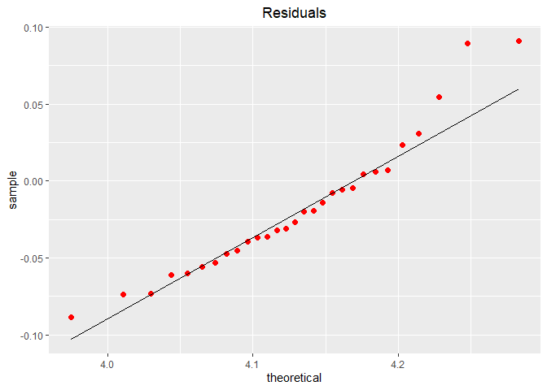

Linear Regression to predict used cars prices
================
Jansen Lopez
6/19/2020

## Dataset: used cars

#### This dataset consists of features of used cars such as:

#### year - year that the car was manufactured

#### model - model of the car

#### price - price of the car in USD

#### mileage - miles travelled by the car

#### color - car color

#### transmission - transmission type

#### Explore, Process, and Prepare the used cars dataset and use a multivariate linear regression to predict used cars price.

# Load Some Libraries that will be heavily used

``` r
library(tidymodels)
```

    ## -- Attaching packages ------------------------------------------------------- tidymodels 0.1.0 --

    ## v broom     0.5.6      v recipes   0.1.12
    ## v dials     0.0.7      v rsample   0.0.7 
    ## v dplyr     1.0.0      v tibble    3.0.1 
    ## v ggplot2   3.3.1      v tune      0.1.0 
    ## v infer     0.5.2      v workflows 0.1.1 
    ## v parsnip   0.1.1      v yardstick 0.0.6 
    ## v purrr     0.3.4

    ## -- Conflicts ---------------------------------------------------------- tidymodels_conflicts() --
    ## x purrr::discard() masks scales::discard()
    ## x dplyr::filter()  masks stats::filter()
    ## x dplyr::lag()     masks stats::lag()
    ## x recipes::step()  masks stats::step()

``` r
library(tidyverse)
```

    ## -- Attaching packages -------------------------------------------------------- tidyverse 1.3.0 --

    ## v tidyr   1.1.0     v stringr 1.4.0
    ## v readr   1.3.1     v forcats 0.5.0

    ## -- Conflicts ----------------------------------------------------------- tidyverse_conflicts() --
    ## x readr::col_factor() masks scales::col_factor()
    ## x purrr::discard()    masks scales::discard()
    ## x dplyr::filter()     masks stats::filter()
    ## x stringr::fixed()    masks recipes::fixed()
    ## x dplyr::lag()        masks stats::lag()
    ## x readr::spec()       masks yardstick::spec()

``` r
library(skimr)
library(readr)
library(rsample)
```

# Load and do preliminary checks on the dataset

``` r
used_cars_raw <- read_csv("usedcars.csv")
```

    ## Parsed with column specification:
    ## cols(
    ##   year = col_double(),
    ##   model = col_character(),
    ##   price = col_double(),
    ##   mileage = col_double(),
    ##   color = col_character(),
    ##   transmission = col_character()
    ## )

``` r
View(used_cars_raw)
used_cars_raw %>% skim
```

|                                                  |            |
| :----------------------------------------------- | :--------- |
| Name                                             | Piped data |
| Number of rows                                   | 150        |
| Number of columns                                | 6          |
| \_\_\_\_\_\_\_\_\_\_\_\_\_\_\_\_\_\_\_\_\_\_\_   |            |
| Column type frequency:                           |            |
| character                                        | 3          |
| numeric                                          | 3          |
| \_\_\_\_\_\_\_\_\_\_\_\_\_\_\_\_\_\_\_\_\_\_\_\_ |            |
| Group variables                                  | None       |

Data summary

**Variable type: character**

| skim\_variable | n\_missing | complete\_rate | min | max | empty | n\_unique | whitespace |
| :------------- | ---------: | -------------: | --: | --: | ----: | --------: | ---------: |
| model          |          0 |              1 |   2 |   3 |     0 |         3 |          0 |
| color          |          0 |              1 |   3 |   6 |     0 |         9 |          0 |
| transmission   |          0 |              1 |   4 |   6 |     0 |         2 |          0 |

**Variable type: numeric**

| skim\_variable | n\_missing | complete\_rate |     mean |       sd |   p0 |      p25 |     p50 |     p75 |   p100 | hist  |
| :------------- | ---------: | -------------: | -------: | -------: | ---: | -------: | ------: | ------: | -----: | :---- |
| year           |          0 |              1 |  2008.73 |     2.20 | 2000 |  2008.00 |  2009.0 |  2010.0 |   2012 | ▁▁▂▇▇ |
| price          |          0 |              1 | 12961.93 |  3122.48 | 3800 | 10995.00 | 13591.5 | 14904.5 |  21992 | ▁▃▇▅▁ |
| mileage        |          0 |              1 | 44260.65 | 26982.10 | 4867 | 27200.25 | 36385.0 | 55124.5 | 151479 | ▇▇▂▁▁ |

``` r
# Check if the dataset has missing values
# fortunately it has none
is.na(used_cars_raw) %>% sum
```

    ## [1] 0

# Get a feel of the dataset via Visualizations and other means

``` r
used_cars_raw %>%
  ggplot(aes(x = price)) + geom_boxplot() +
  labs(title = "Overview of the Car Price Distribution") +
  theme(plot.title = element_text(hjust = 0.5))
```

<!-- -->

``` r
# Mileage magnitude is higher than price
used_cars_raw %>%
  ggplot(aes(x = mileage)) +
  geom_boxplot() +
  labs(title = "Overview of the Car Price Mileage") +
  theme(plot.title = element_text(hjust = 0.5))
```

<!-- -->

``` r
# (Mean)Price Differences in car models seems evident
# Car Model seems to affect the car price
used_cars_raw %>%
  ggplot(aes(x = model, y = price)) +
  geom_boxplot() +
  labs(title = "Overview of the Model - Price Distribution") +
  theme(plot.title = element_text(hjust = 0.5))
```

<!-- -->

``` r
# (Mean)Price Difference in transmission types seems non-evident
# Transmission type seems to not affect the car price
used_cars_raw %>%
  ggplot(aes(x = transmission, y = price)) +
  geom_boxplot() +
  labs(title = "Overview of the Transmission - Price Distribution") +
  theme(plot.title = element_text(hjust = 0.5))
```

<!-- -->

# Validate Assumptions using statistical testss

``` r
# Use t-test to validate that the (Mean)price differences in transmission types
# are by chance

# h0 (Null Hypothesis): The mean difference across transmission types are due to chance
# h1 (Alternate Hypothesis): The mean difference across transmission types are not due by chance  

auto_t <- used_cars_raw %>% filter(transmission == "AUTO")
manual_t <- used_cars_raw %>% filter(transmission == "MANUAL")

auto_t$price %>% skim
```

|                                                  |            |
| :----------------------------------------------- | :--------- |
| Name                                             | Piped data |
| Number of rows                                   | 128        |
| Number of columns                                | 1          |
| \_\_\_\_\_\_\_\_\_\_\_\_\_\_\_\_\_\_\_\_\_\_\_   |            |
| Column type frequency:                           |            |
| numeric                                          | 1          |
| \_\_\_\_\_\_\_\_\_\_\_\_\_\_\_\_\_\_\_\_\_\_\_\_ |            |
| Group variables                                  | None       |

Data summary

**Variable type: numeric**

| skim\_variable | n\_missing | complete\_rate |     mean |      sd |   p0 |   p25 |     p50 |   p75 |  p100 | hist  |
| :------------- | ---------: | -------------: | -------: | ------: | ---: | ----: | ------: | ----: | ----: | :---- |
| data           |          0 |              1 | 13092.92 | 3224.95 | 3800 | 11370 | 13714.5 | 14992 | 21992 | ▂▃▇▅▁ |

``` r
manual_t$price %>% skim
```

|                                                  |            |
| :----------------------------------------------- | :--------- |
| Name                                             | Piped data |
| Number of rows                                   | 22         |
| Number of columns                                | 1          |
| \_\_\_\_\_\_\_\_\_\_\_\_\_\_\_\_\_\_\_\_\_\_\_   |            |
| Column type frequency:                           |            |
| numeric                                          | 1          |
| \_\_\_\_\_\_\_\_\_\_\_\_\_\_\_\_\_\_\_\_\_\_\_\_ |            |
| Group variables                                  | None       |

Data summary

**Variable type: numeric**

| skim\_variable | n\_missing | complete\_rate |     mean |      sd |   p0 |     p25 |     p50 |      p75 |  p100 | hist  |
| :------------- | ---------: | -------------: | -------: | ------: | ---: | ------: | ------: | -------: | ----: | :---- |
| data           |          0 |              1 | 12199.82 | 2359.56 | 7995 | 10786.5 | 12638.5 | 13994.25 | 15988 | ▅▃▇▇▅ |

``` r
# p-value = 0.1312, p-value is not < 0.05 hence we fail to reject the null hypothesis
# Based on the t-test the difference in mean price across transmission types
# are by chance
t.test(auto_t$price, manual_t$price)
```

    ## 
    ##  Welch Two Sample t-test
    ## 
    ## data:  auto_t$price and manual_t$price
    ## t = 1.5446, df = 36.035, p-value = 0.1312
    ## alternative hypothesis: true difference in means is not equal to 0
    ## 95 percent confidence interval:
    ##  -279.5133 2065.7207
    ## sample estimates:
    ## mean of x mean of y 
    ##  13092.92  12199.82

# Correlation and Further Checks

``` r
# There seems to be an inverse linear relationship between price and mileage
# Check the outlier having mileage > 120000 and price > 12000
used_cars_raw %>%
  ggplot(aes(x = mileage, y = price)) +
  geom_point() +
  geom_smooth(method = "lm", se = F, color = "red") +
  labs(title = "Linear Relationship between mileage and price") +
  theme(plot.title = element_text(hjust = 0.5))
```

    ## `geom_smooth()` using formula 'y ~ x'

<!-- -->

# Outlier Check and Outlier Management

``` r
# Outlier Check
print(used_cars_raw %>% filter((used_cars_raw$price > 12000) & (used_cars_raw$mileage > 120000)))
```

    ## # A tibble: 1 x 6
    ##    year model price mileage color transmission
    ##   <dbl> <chr> <dbl>   <dbl> <chr> <chr>       
    ## 1  2008 SE    12995  127327 Red   AUTO

``` r
# Remove the lone outlier later
used_cars_transformed <- subset(used_cars_raw, !((used_cars_raw$price > 12000) & (used_cars_raw$mileage > 120000)))
# Check the dataset dimension
# This should be 149 x 6
print(dim(used_cars_transformed))
```

    ## [1] 149   6

# Feature Engineering

``` r
# Add a feature named car_age that describe the age of a car in days
used_cars_transformed <- used_cars_raw %>%
  mutate(car_age = case_when((365 * (2012 - year) != 0) ~ 365 * (2012 - year),
                             (365 * (2012 - year) == 0) ~ 1))
```

``` r
library(ggcorrplot)
# Check the feature correlations
# Specifically check the correlation of car_age and mileage since they will be used
# as predictors in out linear regression model(Linear Regressions tend to work poorly if
# predictors are highly correlated). They seem to have an acceptable amount (correlation ~= 0.7ish) of correlation which is acceptable 

feature_correlations <- cor(used_cars_transformed %>% select(price, mileage, car_age))
ggcorrplot(feature_correlations)
```

<!-- -->

# Feature Selection

``` r
# We select price(target), mileage, car_age, model (predictors) for our model
used_cars_pre_train <- used_cars_transformed %>%
    select(price, mileage, car_age, model)
```

# Pre Training Split

``` r
# Set a seed so the random processes of the next steps will be reproducible
set.seed(seed = 1972)

train_test_split <-
  rsample::initial_split(
    data = used_cars_pre_train,
    prop = 0.8
  )

train_table <- training(train_test_split)
test_table <- testing(train_test_split)
```

# Data Pre-Processing

``` r
# Rescale the feature values by using log10
# I chose to do this because the features are of varying magnitude
# this prevents features from overwhelming other features in our model

# Convert the feature "model" to factor
recipe_prepped <- recipe(price ~ model + mileage + car_age, data = train_table) %>%
  step_log(price, mileage, car_age, base = 10) %>%
  step_string2factor(model) %>%
  prep(data = train_table)

train_baked <- bake(recipe_prepped, new_data = train_table)
test_baked  <- bake(recipe_prepped, new_data = test_table)
```

# Model Training

``` r
# Use a simple linear regression model to predict used car prices
# using model, mileage, and car_age as predictors
linear_regressor <-
  linear_reg() %>%
  set_engine("lm") %>%
  fit(price ~ model + mileage + car_age, data = train_baked)
```

# Check model information

## Model Formula

### y = 5.43724320 + 0.05868048(modelSEL) + 0.02349163(modelSES) + -0.22957519(mileage) + \#\#\# -0.10442740(car\_age)

``` r
# All features are statistically significant since their p-values are < 0.05
# mileage and car_age negatively affects car price
linear_regressor %>% tidy
```

    ## # A tibble: 5 x 5
    ##   term        estimate std.error statistic  p.value
    ##   <chr>          <dbl>     <dbl>     <dbl>    <dbl>
    ## 1 (Intercept)   5.44      0.126      43.0  3.98e-73
    ## 2 modelSEL      0.0587    0.0217      2.71 7.74e- 3
    ## 3 modelSES      0.0235    0.0167      1.41 1.61e- 1
    ## 4 mileage      -0.230     0.0352     -6.51 1.97e- 9
    ## 5 car_age      -0.104     0.0261     -4.00 1.12e- 4

``` r
# Relatively acceptable adjusted r^2 value
linear_regressor$fit %>% glance
```

    ## # A tibble: 1 x 11
    ##   r.squared adj.r.squared  sigma statistic  p.value    df logLik   AIC   BIC
    ##       <dbl>         <dbl>  <dbl>     <dbl>    <dbl> <int>  <dbl> <dbl> <dbl>
    ## 1     0.642         0.630 0.0794      52.0 5.05e-25     5   137. -263. -246.
    ## # ... with 2 more variables: deviance <dbl>, df.residual <int>

# Predict Values and Check goodness of fit

``` r
predicted_prices <- predict(linear_regressor, new_data = test_baked)

original_prices <- test_baked %>%
    select(price) %>%
    rename(.pred = price) %>% 
    mutate(car_id = row_number(), label = "original_price")
    

predicted_prices %>%
    mutate(car_id = row_number(),label = "predicted_price") %>%
    bind_rows(original_prices) %>%
    ggplot(aes(x = car_id, y = .pred, color = label)) +
    geom_point(size = 2) +
    labs(title = "Log10 Scale", x = "Car ID", y = "Predicted Car Price") +
    theme(plot.title = element_text(hjust = 0.5))
```

<!-- -->

``` r
predicted_prices %>%
    mutate(car_id = row_number(), label = "predicted_price") %>%
    bind_rows(original_prices) %>%
    mutate(.pred = 10^.pred) %>%
    ggplot(aes(x = car_id, y = .pred, color = label)) +
    geom_point(size = 2) +
    labs(title = "Original Scale", x = "Car ID", y = "Predicted Car Price") +
    theme(plot.title = element_text(hjust = 0.5))
```

<!-- -->

# Sum of Squared Errors

``` r
print(sum((test_baked$price - predicted_prices)^2))
```

    ## [1] 0.06493493

# Residual Analysis

``` r
# We hope that the residuals' distribution is approximately normal since this condition ensures model integrity
# Plot a qqplot and hopefully the data points mostly stay within the diagonal

avg_price <- mean(test_baked$price)
sd_price <- sd(test_baked$price)
residuals <- predicted_prices - test_baked$price 
absolute_residuals <- abs(predicted_prices - test_baked$price) 

# The residuals mainly stay within the diagonal with 5 off data points 

residuals %>%
    ggplot(aes(sample = .pred)) +
    stat_qq(dparams = list(m = avg_price, s = sd_price), color = "red", size = 2) +
    stat_qq_line(dparams = list(m = avg_price, s = sd_price)) +
    labs(title = "Residuals") +
    theme(plot.title = element_text(hjust = 0.5))
```

<!-- -->

# Aboslute Residuals

``` r
# The absolute residuals seems to be more intact within the diagonal

absolute_residuals %>%
    ggplot(aes(sample = .pred)) +
    stat_qq(dparams = list(m = avg_price, s = sd_price), color = "red", size = 2) +
    stat_qq_line(dparams = list(m = avg_price, s = sd_price)) +
    labs(title = "Absolute Residuals") +
    theme(plot.title = element_text(hjust = 0.5))
```

<!-- -->

## Conclusion:

### Using a Linear Regression model we were able to predict the price of a used car with a respectable r-squared value. We were able to choose factors that succeeded in explaining the price by investigating the relationship of mileage to price and if car models affects the car price. Then we were able to create a feature named “car\_age” that describes how old was the car in days that became a strong predictor of car price. Lastly we were able to validate the integrity of the model by checking if the residuals were normally distributed.

## Recommendations

### 1\. Engineer more features to increase r-squared

### 2\. Use K-Fold Cross Validation in training the model
