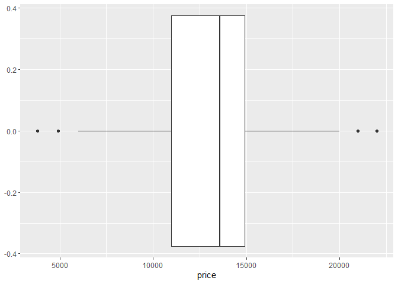
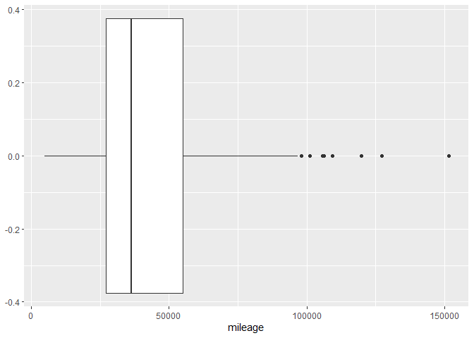
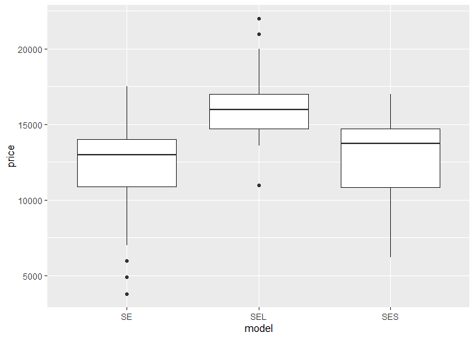
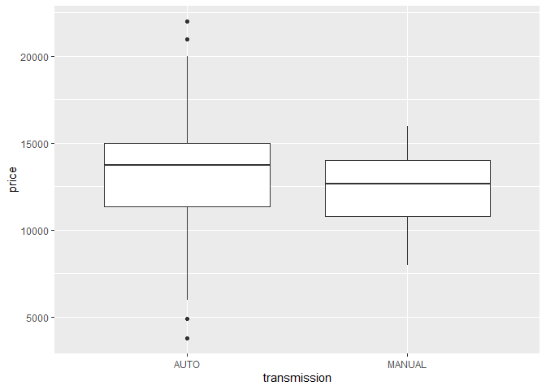
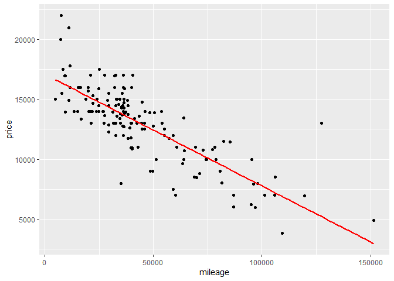
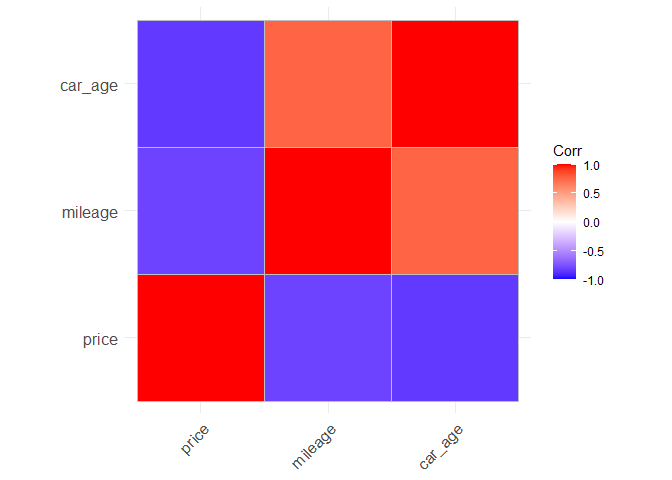

Linear Regression to predict used cars prices
================
Jansen Lopez
6/18/2020

## R Markdown

This is an R Markdown document. Markdown is a simple formatting syntax
for authoring HTML, PDF, and MS Word documents. For more details on
using R Markdown see <http://rmarkdown.rstudio.com>.

When you click the **Knit** button a document will be generated that
includes both content as well as the output of any embedded R code
chunks within the document. You can embed an R code chunk like this:

``` r
summary(cars)
```

    ##      speed           dist       
    ##  Min.   : 4.0   Min.   :  2.00  
    ##  1st Qu.:12.0   1st Qu.: 26.00  
    ##  Median :15.0   Median : 36.00  
    ##  Mean   :15.4   Mean   : 42.98  
    ##  3rd Qu.:19.0   3rd Qu.: 56.00  
    ##  Max.   :25.0   Max.   :120.00

## Including Plots

You can also embed plots, for example:

<!-- -->

Note that the `echo = FALSE` parameter was added to the code chunk to
prevent printing of the R code that generated the plot.

### Dataset: used cars

### This dataset consists of factors the prices of several used cars

### Explore, Process, and prepare a used cars dataset

### Use a multivariate linear regression to predict used cars price

### Load Some Libraries that will be heavily used

    ## -- Attaching packages ------------------------------------------------------- tidymodels 0.1.0 --

    ## v broom     0.5.6      v recipes   0.1.12
    ## v dials     0.0.7      v rsample   0.0.7 
    ## v dplyr     1.0.0      v tibble    3.0.1 
    ## v ggplot2   3.3.1      v tune      0.1.0 
    ## v infer     0.5.2      v workflows 0.1.1 
    ## v parsnip   0.1.1      v yardstick 0.0.6 
    ## v purrr     0.3.4

    ## -- Conflicts ---------------------------------------------------------- tidymodels_conflicts() --
    ## x purrr::discard() masks scales::discard()
    ## x dplyr::filter()  masks stats::filter()
    ## x dplyr::lag()     masks stats::lag()
    ## x recipes::step()  masks stats::step()

    ## -- Attaching packages -------------------------------------------------------- tidyverse 1.3.0 --

    ## v tidyr   1.1.0     v stringr 1.4.0
    ## v readr   1.3.1     v forcats 0.5.0

    ## -- Conflicts ----------------------------------------------------------- tidyverse_conflicts() --
    ## x readr::col_factor() masks scales::col_factor()
    ## x purrr::discard()    masks scales::discard()
    ## x dplyr::filter()     masks stats::filter()
    ## x stringr::fixed()    masks recipes::fixed()
    ## x dplyr::lag()        masks stats::lag()
    ## x readr::spec()       masks yardstick::spec()

# Load and do premliminary checks on the dataset

``` r
used_cars_raw <- read_csv("usedcars.csv")
```

    ## Parsed with column specification:
    ## cols(
    ##   year = col_double(),
    ##   model = col_character(),
    ##   price = col_double(),
    ##   mileage = col_double(),
    ##   color = col_character(),
    ##   transmission = col_character()
    ## )

``` r
View(used_cars_raw)
used_cars_raw %>% skim
```

|                                                  |            |
| :----------------------------------------------- | :--------- |
| Name                                             | Piped data |
| Number of rows                                   | 150        |
| Number of columns                                | 6          |
| \_\_\_\_\_\_\_\_\_\_\_\_\_\_\_\_\_\_\_\_\_\_\_   |            |
| Column type frequency:                           |            |
| character                                        | 3          |
| numeric                                          | 3          |
| \_\_\_\_\_\_\_\_\_\_\_\_\_\_\_\_\_\_\_\_\_\_\_\_ |            |
| Group variables                                  | None       |

Data summary

**Variable type: character**

| skim\_variable | n\_missing | complete\_rate | min | max | empty | n\_unique | whitespace |
| :------------- | ---------: | -------------: | --: | --: | ----: | --------: | ---------: |
| model          |          0 |              1 |   2 |   3 |     0 |         3 |          0 |
| color          |          0 |              1 |   3 |   6 |     0 |         9 |          0 |
| transmission   |          0 |              1 |   4 |   6 |     0 |         2 |          0 |

**Variable type: numeric**

| skim\_variable | n\_missing | complete\_rate |     mean |       sd |   p0 |      p25 |     p50 |     p75 |   p100 | hist  |
| :------------- | ---------: | -------------: | -------: | -------: | ---: | -------: | ------: | ------: | -----: | :---- |
| year           |          0 |              1 |  2008.73 |     2.20 | 2000 |  2008.00 |  2009.0 |  2010.0 |   2012 | ▁▁▂▇▇ |
| price          |          0 |              1 | 12961.93 |  3122.48 | 3800 | 10995.00 | 13591.5 | 14904.5 |  21992 | ▁▃▇▅▁ |
| mileage        |          0 |              1 | 44260.65 | 26982.10 | 4867 | 27200.25 | 36385.0 | 55124.5 | 151479 | ▇▇▂▁▁ |

``` r
### Check if the dataset has missing values
### fortunately it has none
is.na(used_cars_raw) %>% sum
```

    ## [1] 0

# Get a feel of the dataset via Visualizations and other means

``` r
used_cars_raw %>%
  ggplot(aes(x = price)) + geom_boxplot()
```

<!-- -->

``` r
### Mileage magnitude is higher than price
used_cars_raw %>%
  ggplot(aes(x = mileage)) + geom_boxplot()
```

<!-- -->

``` r
# (Mean)Price Differences in car models seems evident
used_cars_raw %>%
  ggplot(aes(x = model, y = price)) +
  geom_boxplot()
```

<!-- -->

``` r
# (Mean)Price Difference in transmission types seems non-evident
used_cars_raw %>%
  ggplot(aes(x = transmission, y = price)) +
  geom_boxplot()
```

<!-- -->

``` r
# Use t-test to validate that the (Mean)price differences in transmission types
# are by chance

# h0 (Null Hypothesis): The mean difference are due to chance
# h1 (Alternate Hypothesis): The mean difference is not due by chance  

auto_t <- used_cars_raw %>% filter(transmission == "AUTO")
manual_t <- used_cars_raw %>% filter(transmission == "MANUAL")

auto_t$price %>% skim
```

|                                                  |            |
| :----------------------------------------------- | :--------- |
| Name                                             | Piped data |
| Number of rows                                   | 128        |
| Number of columns                                | 1          |
| \_\_\_\_\_\_\_\_\_\_\_\_\_\_\_\_\_\_\_\_\_\_\_   |            |
| Column type frequency:                           |            |
| numeric                                          | 1          |
| \_\_\_\_\_\_\_\_\_\_\_\_\_\_\_\_\_\_\_\_\_\_\_\_ |            |
| Group variables                                  | None       |

Data summary

**Variable type: numeric**

| skim\_variable | n\_missing | complete\_rate |     mean |      sd |   p0 |   p25 |     p50 |   p75 |  p100 | hist  |
| :------------- | ---------: | -------------: | -------: | ------: | ---: | ----: | ------: | ----: | ----: | :---- |
| data           |          0 |              1 | 13092.92 | 3224.95 | 3800 | 11370 | 13714.5 | 14992 | 21992 | ▂▃▇▅▁ |

``` r
manual_t$price %>% skim
```

|                                                  |            |
| :----------------------------------------------- | :--------- |
| Name                                             | Piped data |
| Number of rows                                   | 22         |
| Number of columns                                | 1          |
| \_\_\_\_\_\_\_\_\_\_\_\_\_\_\_\_\_\_\_\_\_\_\_   |            |
| Column type frequency:                           |            |
| numeric                                          | 1          |
| \_\_\_\_\_\_\_\_\_\_\_\_\_\_\_\_\_\_\_\_\_\_\_\_ |            |
| Group variables                                  | None       |

Data summary

**Variable type: numeric**

| skim\_variable | n\_missing | complete\_rate |     mean |      sd |   p0 |     p25 |     p50 |      p75 |  p100 | hist  |
| :------------- | ---------: | -------------: | -------: | ------: | ---: | ------: | ------: | -------: | ----: | :---- |
| data           |          0 |              1 | 12199.82 | 2359.56 | 7995 | 10786.5 | 12638.5 | 13994.25 | 15988 | ▅▃▇▇▅ |

``` r
# p-value = 0.1312, p-value is not < 0.05 hence we fail to reject the null hypothesis
# Based on the t-test the difference in mean price across transmission type
# are by chance
t.test(auto_t$price, manual_t$price)
```

    ## 
    ##  Welch Two Sample t-test
    ## 
    ## data:  auto_t$price and manual_t$price
    ## t = 1.5446, df = 36.035, p-value = 0.1312
    ## alternative hypothesis: true difference in means is not equal to 0
    ## 95 percent confidence interval:
    ##  -279.5133 2065.7207
    ## sample estimates:
    ## mean of x mean of y 
    ##  13092.92  12199.82

# Correlation and Further Checks

``` r
# There seems to be an inverse linear relationship between price and mileage
# Check the outlier having mileage > 120000 and price > 12000
used_cars_raw %>%
  ggplot(aes(x = mileage, y = price)) +
  geom_point() +
  geom_smooth(method = "lm", se = F, color = "red")
```

    ## `geom_smooth()` using formula 'y ~ x'

<!-- -->

# Outlier Check and Outlier Management

``` r
# Outlier Check
used_cars_raw %>% filter((used_cars_raw$price > 12000) & (used_cars_raw$mileage > 120000))
```

    ## # A tibble: 1 x 6
    ##    year model price mileage color transmission
    ##   <dbl> <chr> <dbl>   <dbl> <chr> <chr>       
    ## 1  2008 SE    12995  127327 Red   AUTO

``` r
# Remove the lone outlier later
used_cars_transformed <- subset(used_cars_raw, !((used_cars_raw$price > 12000) & (used_cars_raw$mileage > 120000)))
# Check the dataset dimension
used_cars_transformed %>% dim
```

    ## [1] 149   6

# Feature Engineering

``` r
# Add a feature named car_age that describe the age of a car in days
used_cars_transformed <- used_cars_raw %>%
  mutate(car_age = case_when((365 * (2012 - year) != 0) ~ 365 * (2012 - year),
                             (365 * (2012 - year) == 0) ~ 1))
```

``` r
library(ggcorrplot)
# Check the feature correlations
# Specifically check the correlation of car_age and mileage since they will be used
# as predictors in out linear regression model(Linear Regression tend to work poorly if # # # predictors are highly correlated). They seem to have an acceptable amount (correlation ~= 0.7ish) of
# correlation which is acceptable 

feature_correlations <- cor(used_cars_transformed %>% select(price, mileage, car_age))
ggcorrplot(feature_correlations)
```

<!-- -->
